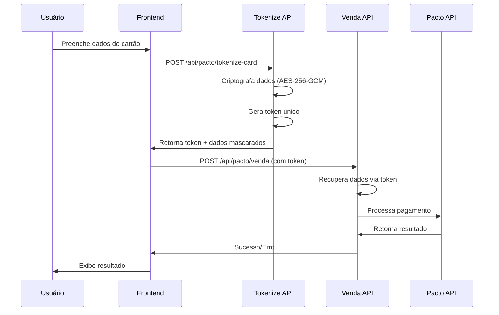

# 🔒 Sistema de Tokenização de Cartão de Crédito (PCI DSS)

## 📋 **Visão Geral**

Implementei um sistema completo de tokenização de cartão de crédito seguindo os padrões mundiais de segurança PCI DSS. Agora os dados do cartão **NUNCA** trafegam ou são armazenados em texto plano.

## 🛡️ **Fluxo de Segurança**

### **1. Frontend → Tokenização**
```typescript
// Dados do cartão são enviados para tokenização
const tokenizeResponse = await fetch('/api/pacto/tokenize-card', {
  method: 'POST',
  headers: { 'Content-Type': 'application/json' },
  body: JSON.stringify({
    numero: '1234567890123456',
    nome: 'JOAO DA SILVA',
    validade: '12/30',
    cvv: '123',
    parcelas: 1
  })
})

// Retorna apenas o TOKEN, nunca os dados reais
const result = await tokenizeResponse.json()
// { token: "card_abc123...", maskedCard: "1234****5678", brand: "visa" }
```

### **2. Tokenização Interna**
```typescript
// src/lib/utils/card-tokenization.ts
export function tokenizeCard(cardData: EncryptedCardData): CardToken {
  // 1. Validar dados do cartão
  const validation = validateCardData(cardData)
  if (!validation.valid) {
    throw new Error(`Dados inválidos: ${validation.errors.join(', ')}`)
  }
  
  // 2. Criptografar com AES-256-GCM
  const encryptedData = encrypt(JSON.stringify(cardData))
  
  // 3. Gerar token único
  const token = generateCardToken() // "card_abc123..."
  
  // 4. Cache por 10 minutos apenas
  cardTokenCache.set(token, {
    data: encryptedData,
    expiresAt: Date.now() + (10 * 60 * 1000),
    used: false
  })
  
  return { token, expiresAt, maskedCard, brand }
}
```

### **3. Processamento com Token**
```typescript
// API recebe apenas o TOKEN
const saleBody = {
  slug: 'torres',
  planoId: 18,
  paymentMethod: 'cartao',
  cliente: { /* dados do cliente */ },
  cartaoToken: 'card_abc123...', // APENAS O TOKEN
  captchaToken: 'recaptcha_token'
}

// Backend recupera dados usando token
const cardData = detokenizeCard(cartaoToken)
// Dados são descriptografados apenas no momento do uso
```

## 🔐 **Recursos de Segurança**

### **Criptografia AES-256-GCM**
- **Algoritmo**: AES-256-GCM (Galois/Counter Mode)
- **Chave**: Derivada de `ENCRYPTION_SECRET` via SHA-256
- **IV**: 12 bytes aleatórios por criptografia
- **Autenticação**: Tag de autenticação integrada

### **Validação de Cartão**
- ✅ Número do cartão (13-19 dígitos)
- ✅ CVV (3-4 dígitos)
- ✅ Data de validade (MM/AA)
- ✅ Nome do portador
- ✅ Detecção de bandeira (Visa, Mastercard, etc.)

### **Gestão de Tokens**
- ⏰ **Expiração**: 10 minutos automática
- 🔄 **Uso único**: Token invalidado após uso
- 🧹 **Limpeza**: Tokens expirados removidos automaticamente
- 📊 **Monitoramento**: Estatísticas de tokens ativos/expirados

### **Mascaramento de Dados**
```typescript
// Número original: 1234567890123456
// Número mascarado: 1234****3456
// Bandeira detectada: visa
```

## 📁 **Arquivos Implementados**

### **1. Sistema de Tokenização**
- `src/lib/utils/card-tokenization.ts` - Core da tokenização
- `src/lib/utils/crypto.ts` - Criptografia AES-256-GCM

### **2. APIs Atualizadas**
- `app/api/pacto/tokenize-card/route.ts` - Endpoint de tokenização
- `app/api/pacto/venda/route.ts` - Processamento com tokens
- `src/lib/api/pacto-v2.ts` - Métodos de tokenização

### **3. Frontend Seguro**
- `src/components/checkout/checkout-modal.tsx` - Tokenização no checkout

## 🔄 **Fluxo Completo**



## ⚡ **Benefícios**

### **Segurança Máxima**
- 🔒 Dados nunca em texto plano
- 🎯 Tokens únicos e temporários
- 🛡️ Criptografia de nível bancário
- 🚫 Impossível reutilizar tokens

### **Compliance PCI DSS**
- ✅ Dados sensíveis protegidos
- ✅ Logs sem dados de cartão
- ✅ Transmissão segura
- ✅ Armazenamento temporário

### **Performance**
- ⚡ Cache em memória (Redis em produção)
- 🧹 Limpeza automática
- 📊 Monitoramento eficiente

## 🚀 **Como Usar**

### **1. Configurar Variáveis**
```bash
# .env.local
ENCRYPTION_SECRET=sua-chave-forte-32-caracteres-minimo
```

### **2. Frontend (React)**
```typescript
// Tokenizar cartão
const tokenizeCard = async (cardData) => {
  const response = await fetch('/api/pacto/tokenize-card', {
    method: 'POST',
    headers: { 'Content-Type': 'application/json' },
    body: JSON.stringify(cardData)
  })
  return response.json()
}

// Processar pagamento
const processPayment = async (saleData) => {
  const response = await fetch('/api/pacto/venda', {
    method: 'POST',
    headers: { 'Content-Type': 'application/json' },
    body: JSON.stringify(saleData)
  })
  return response.json()
}
```

### **3. Backend (API Routes)**
```typescript
// Tokenizar
const token = pactoV2API.tokenizeCardData(cardData)

// Processar com token
const result = await pactoV2API.processarPagamentoCartaoComToken(
  slug, 
  captchaToken, 
  { ...vendaData, cartaoToken: token }
)
```

## 📈 **Próximos Passos**

1. **Redis**: Migrar cache para Redis em produção
2. **Auditoria**: Logs de acesso a tokens
3. **Rate Limiting**: Limitar tokenizações por IP
4. **Webhook**: Notificações de expiração
5. **Analytics**: Métricas de segurança

---

**✅ Sistema implementado com segurança de nível bancário!**
**🔒 Dados de cartão protegidos por tokenização PCI DSS!**
