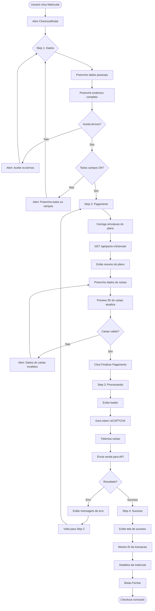
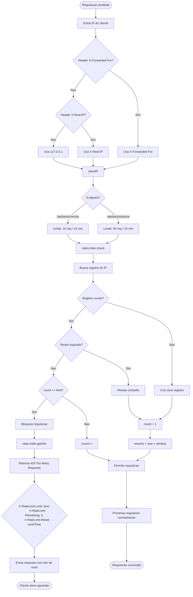

# Fluxogramas do Sistema de Checkout - Live Academia

**Versao**: 1.0.0
**Data**: 2025-10-16

---

## Indice

1. [Fluxo Geral do Checkout](#1-fluxo-geral-do-checkout)
2. [Fluxo de Tokenizacao de Cartao](#2-fluxo-de-tokenizacao-de-cartao)
3. [Fluxo de Validacao reCAPTCHA](#3-fluxo-de-validacao-recaptcha)
4. [Fluxo de Rate Limiting](#4-fluxo-de-rate-limiting)
5. [Fluxo de Consulta de Planos](#5-fluxo-de-consulta-de-planos)
6. [Fluxo de Processamento de Venda](#6-fluxo-de-processamento-de-venda)
7. [Fluxo de Simulacao de Venda](#7-fluxo-de-simulacao-de-venda)
8. [Arquitetura de Camadas](#8-arquitetura-de-camadas)

---

## 1. Fluxo Geral do Checkout



---

## 2. Fluxo de Tokenizacao de Cartao

```mermaid
graph TB
    Start([Dados do cartao preenchidos]) --> Submit[Usuario clica Finalizar]

    Submit --> SendToAPI[POST /api/pacto/tokenize-card]

    SendToAPI --> Validate{Validacao}

    Validate -->|Numero invalido| Error1[Erro: Numero do cartao invalido]
    Validate -->|CVV invalido| Error2[Erro: CVV invalido]
    Validate -->|Validade invalida| Error3[Erro: Data de validade invalida]
    Validate -->|Cartao expirado| Error4[Erro: Cartao expirado]
    Validate -->|Nome invalido| Error5[Erro: Nome do portador invalido]

    Error1 --> ReturnError[Retorna 400 com mensagem]
    Error2 --> ReturnError
    Error3 --> ReturnError
    Error4 --> ReturnError
    Error5 --> ReturnError
    ReturnError --> End1([Usuario corrige dados])

    Validate -->|Dados OK| DetectBrand[Detecta bandeira do cartao]
    DetectBrand --> MaskCard[Mascara numero: 1234****5678]
    MaskCard --> GenerateToken[Gera token aleatorio]

    GenerateToken --> TokenFormat[token = 'card_' + randomBytes(16)]
    TokenFormat --> Encrypt[Criptografa dados AES-256-GCM]

    Encrypt --> StoreCache[Armazena em cache]
    StoreCache --> SetExpiry[Define expiracao: 10 minutos]
    SetExpiry --> MarkUnused[Marca como nao usado]

    MarkUnused --> ReturnSuccess[Retorna token ao frontend]
    ReturnSuccess --> Response{
        token: 'card_abc123...',
        maskedCard: '1234****5678',
        brand: 'visa',
        expiresAt: timestamp
    }

    Response --> FrontendStore[Frontend armazena token]
    FrontendStore --> SendInVenda[Token enviado na venda]

    SendInVenda --> Detokenize[Backend: detokenizeCard]
    Detokenize --> CheckCache{Token existe?}

    CheckCache -->|Nao| ErrorNotFound[Erro: Token invalido]
    ErrorNotFound --> End2([Solicitar re-tokenizacao])

    CheckCache -->|Sim| CheckUsed{Ja foi usado?}
    CheckUsed -->|Sim| ErrorUsed[Erro: Token ja utilizado]
    ErrorUsed --> End2

    CheckUsed -->|Nao| CheckExpired{Expirado?}
    CheckExpired -->|Sim| ErrorExpired[Erro: Token expirado]
    ErrorExpired --> DeleteFromCache[Remove do cache]
    DeleteFromCache --> End2

    CheckExpired -->|Nao| MarkUsed[Marca como usado]
    MarkUsed --> DecryptData[Descriptografa dados]
    DecryptData --> ReturnCardData[Retorna dados do cartao]
    ReturnCardData --> UseInPayment[Usa para processar pagamento]
    UseInPayment --> End3([Pagamento processado])
```

---

## 3. Fluxo de Validacao reCAPTCHA

```mermaid
graph TB
    Start([Checkout inicia]) --> LoadHook[useRecaptcha hook carrega]

    LoadHook --> CheckEnv{NEXT_PUBLIC_RECAPTCHA_SITE_KEY existe?}

    CheckEnv -->|Nao| ErrorConfig[Erro: reCAPTCHA nao configurado]
    ErrorConfig --> DisableSubmit[Desabilita botao de envio]
    DisableSubmit --> End1([Usuario nao pode finalizar])

    CheckEnv -->|Sim| CheckLoaded{grecaptcha carregado?}

    CheckLoaded -->|Nao| LoadScript[Carrega script do Google]
    LoadScript --> ScriptURL[src: google.com/recaptcha/api.js]
    ScriptURL --> WaitReady[grecaptcha.ready]
    WaitReady --> SetLoaded[setIsLoaded = true]

    CheckLoaded -->|Sim| SetLoaded

    SetLoaded --> EnableSubmit[Habilita botao de envio]
    EnableSubmit --> UserClick[Usuario clica Finalizar]

    UserClick --> ExecuteCaptcha[executeRecaptcha('checkout')]
    ExecuteCaptcha --> GoogleExecute[grecaptcha.execute]

    GoogleExecute --> GenerateToken[Google gera token]
    GenerateToken --> ReturnToken[Retorna token ao frontend]

    ReturnToken --> SendToBackend[Token enviado na venda]
    SendToBackend --> BackendVerify[Backend: verifyRecaptcha]

    BackendVerify --> PostToGoogle[POST google.com/recaptcha/api/siteverify]
    PostToGoogle --> GoogleResponse{Resposta do Google}

    GoogleResponse -->|success: false| ErrorVerify[Erro: Validacao falhou]
    ErrorVerify --> ReturnError[Retorna 403 Forbidden]
    ReturnError --> ShowAlert[Alert: Validacao de seguranca falhou]
    ShowAlert --> End2([Usuario tenta novamente])

    GoogleResponse -->|success: true| CheckScore{score >= 0.5?}

    CheckScore -->|Nao| ErrorBot[Possivel bot detectado]
    ErrorBot --> ReturnError

    CheckScore -->|Sim| AllowProceed[Permite prosseguir]
    AllowProceed --> ProcessPayment[Processa pagamento]
    ProcessPayment --> End3([Venda aprovada])
```

---

## 4. Fluxo de Rate Limiting



---

## 5. Fluxo de Consulta de Planos

```mermaid
graph TB
    Start([Requisicao GET /api/pacto/planos/slug]) --> ExtractSlug[Extrai slug do path]

    ExtractSlug --> RateLimit[Verifica rate limit]
    RateLimit --> RateLimitOK{Rate OK?}

    RateLimitOK -->|Nao| Return429[Retorna 429 Too Many Requests]
    Return429 --> End1([Cliente aguarda])

    RateLimitOK -->|Sim| CheckCache[Verifica cache]
    CheckCache --> CacheKey[Key: 'planos:slug']
    CacheKey --> CacheExists{Cache existe?}

    CacheExists -->|Sim| CheckExpired{Expirado?}
    CheckExpired -->|Sim| DeleteCache[Remove do cache]
    DeleteCache --> CacheMiss[Cache miss]

    CheckExpired -->|Nao| CacheHit[Cache hit]
    CacheHit --> ReturnCached[Retorna dados do cache]
    ReturnCached --> Response1{
        planos: [...],
        source: 'cache',
        fallback: false
    }
    Response1 --> End2([Resposta rapida])

    CacheExists -->|Nao| CacheMiss

    CacheMiss --> FindLocation[Busca unidade em locations.ts]
    FindLocation --> LocationExists{Unidade existe?}

    LocationExists -->|Nao| Return404[Retorna 404 Not Found]
    Return404 --> End3([Unidade nao encontrada])

    LocationExists -->|Sim| GetUnitConfig[getUnidadeConfig(slug)]
    GetUnitConfig --> LoadKeys[Carrega chaves da unidade]
    LoadKeys --> CallAPI[pactoV2API.getPlanosUnidade]

    CallAPI --> APIRequest[POST /api/vendas/planos]
    APIRequest --> APIResponse{Sucesso?}

    APIResponse -->|Nao| APIError[Erro na API]
    APIError --> UseFallback[Usa dados estaticos de locations.ts]
    UseFallback --> Response2{
        planos: staticPlanos,
        source: 'static',
        fallback: true,
        error: message
    }
    Response2 --> End4([Fallback ativado])

    APIResponse -->|Sim| ParsePlanos[Parse resposta da API]
    ParsePlanos --> StoreCache[Armazena no cache]
    StoreCache --> SetTTL[TTL: 30 minutos]
    SetTTL --> Response3{
        planos: [...],
        source: 'api',
        fallback: false
    }
    Response3 --> End5([Dados atualizados])
```

---

## 6. Fluxo de Processamento de Venda

```mermaid
graph TB
    Start([POST /api/pacto/venda]) --> ParseBody[Parse JSON body]

    ParseBody --> ValidateFields{Campos obrigatorios?}
    ValidateFields -->|Nao| Return400[Retorna 400 Bad Request]
    Return400 --> End1([Erro de validacao])

    ValidateFields -->|Sim| ExtractData[Extrai: slug, planoId, paymentMethod, cliente, cartaoToken, captchaToken]

    ExtractData --> RateLimit[Verifica rate limit]
    RateLimit --> RateLimitOK{Rate OK?}

    RateLimitOK -->|Nao| Return429[Retorna 429 + info de reset]
    Return429 --> End2([Cliente aguarda])

    RateLimitOK -->|Sim| GetClientIP[Obtem IP do cliente]
    GetClientIP --> CheckBlacklist[verificarBlacklist(IP)]

    CheckBlacklist --> IsBlacklisted{IP bloqueado?}
    IsBlacklisted -->|Sim| Return403A[Retorna 403 Forbidden]
    Return403A --> End3([Operacao bloqueada por seguranca])

    IsBlacklisted -->|Nao| VerifyCaptcha[verifyRecaptcha(captchaToken)]
    VerifyCaptcha --> CallGoogleAPI[POST google.com/recaptcha/api/siteverify]

    CallGoogleAPI --> CaptchaValid{reCAPTCHA valido?}
    CaptchaValid -->|Nao| Return403B[Retorna 403 Forbidden]
    Return403B --> End4([Validacao de seguranca falhou])

    CaptchaValid -->|Sim| CheckMethod{paymentMethod?}

    CheckMethod -->|cartao| ProcessCard[Processar cartao]
    CheckMethod -->|pix| ProcessPIX[Processar PIX]
    CheckMethod -->|boleto| ProcessBoleto[Processar Boleto]
    CheckMethod -->|outro| Return400B[Retorna 400 Bad Request]
    Return400B --> End5([Metodo invalido])

    ProcessCard --> ValidateToken{cartaoToken existe?}
    ValidateToken -->|Nao| Return400C[Retorna 400: Token obrigatorio]
    Return400C --> End6([Token ausente])

    ValidateToken -->|Sim| DetokenizeCard[detokenizeCard(cartaoToken)]
    DetokenizeCard --> TokenValid{Token valido?}

    TokenValid -->|Nao| Return400D[Retorna 400: Token invalido/expirado]
    Return400D --> End7([Token invalido])

    TokenValid -->|Sim| BuildVendaData[Monta TokenizedVendaData]
    BuildVendaData --> CallPactoAPI[processarPagamentoCartaoComToken]

    ProcessPIX --> BuildVendaPIX[Monta PactoVendaData para PIX]
    BuildVendaPIX --> CallPactoAPIPIX[processarPagamentoPIX]

    ProcessBoleto --> BuildVendaBoleto[Monta PactoVendaData para Boleto]
    BuildVendaBoleto --> CallPactoAPIBoleto[processarPagamentoBoleto]

    CallPactoAPI --> PactoRequest[POST /api/vendas/venda]
    CallPactoAPIPIX --> PactoRequest
    CallPactoAPIBoleto --> PactoRequest

    PactoRequest --> PactoResponse{Resposta Pacto?}

    PactoResponse -->|Erro| LogError[Log erro no Supabase]
    LogError --> Return500[Retorna 500 Internal Server Error]
    Return500 --> End8([Falha no processamento])

    PactoResponse -->|Sucesso| LogSuccess[Log sucesso no Supabase]
    LogSuccess --> ReturnSuccess{
        success: true,
        data: {
            codigo,
            status,
            transacao,
            valor
        }
    }
    ReturnSuccess --> End9([Venda aprovada])
```

---

## 7. Fluxo de Simulacao de Venda

```mermaid
graph TB
    Start([Usuario avanca para Step 2]) --> TriggerUseEffect[useEffect detecta step === 2]

    TriggerUseEffect --> CheckDebouncing{isDebouncing?}
    CheckDebouncing -->|Sim| Wait[Aguarda debounce terminar]
    Wait --> End1([Simulacao cancelada])

    CheckDebouncing -->|Nao| SetLoading[setSimulationLoading = true]
    SetLoading --> ClearError[setSimulationError = null]
    ClearError --> ClearData[setSimulation = null]

    ClearData --> PreparePayload[Monta payload da simulacao]
    PreparePayload --> ClientData{
        slug: unidadeId,
        planoId: plano.codigo,
        cliente: {
            nome, cpf, email, telefone,
            endereco, etc
        },
        paymentMethod
    }

    ClientData --> PostAPI[POST /api/pacto-v3/simular/slug/planoId]
    PostAPI --> APIHandler[API Route Handler]

    APIHandler --> GetChave[getChaveSecretaUnidade(slug)]
    GetChave --> ChaveExists{Chave encontrada?}

    ChaveExists -->|Nao| ReturnError1[Retorna 500: Chave nao configurada]
    ReturnError1 --> FrontendError1[setSimulationError]
    FrontendError1 --> ShowRetryButton[Exibe botao Tentar Novamente]
    ShowRetryButton --> End2([Usuario pode tentar novamente])

    ChaveExists -->|Sim| CallPactoV3[POST /psec/vendas/simularVenda/planoId]
    CallPactoV3 --> AddAuthHeader[Authorization: Bearer chave_secreta]

    AddAuthHeader --> PactoResponse{Resposta Pacto?}

    PactoResponse -->|Erro| ReturnError2[Retorna 500 com erro]
    ReturnError2 --> FrontendError2[setSimulationError]
    FrontendError2 --> ShowRetryButton

    PactoResponse -->|Sucesso| ParseResponse[Parse resposta]
    ParseResponse --> ExtractData{
        retorno: {
            valor,
            parcelas: [
                { numero, valor, vencimento }
            ],
            taxas,
            total
        }
    }

    ExtractData --> StoreCache[Opcional: armazena no cache]
    StoreCache --> ReturnSuccess[Retorna 200 com dados]

    ReturnSuccess --> FrontendReceive[Frontend recebe simulacao]
    FrontendReceive --> SetSimulation[setSimulation(data)]
    SetSimulation --> SetFallback[setSimulationFallback(false)]
    SetFallback --> SetLoadingFalse[setSimulationLoading(false)]

    SetLoadingFalse --> StartDebounce[startDebounce(2000ms)]
    StartDebounce --> RenderResume[Renderiza resumo do plano]

    RenderResume --> ShowTotal[Exibe valorTotal]
    ShowTotal --> ShowParcelas[Exibe parcelas]
    ShowParcelas --> EnablePayment[Habilita preenchimento do cartao]
    EnablePayment --> End3([Usuario pode prosseguir])
```

---

## 8. Arquitetura de Camadas

```mermaid
graph TB
    subgraph "Camada de Apresentacao"
        A1[CheckoutModal.tsx]
        A2[AnimatedPaymentCard.tsx]
        A3[UnidadeContent.tsx]
        A1 --> A2
        A3 --> A1
    end

    subgraph "Camada de Hooks"
        B1[useRecaptcha]
        B2[useDebounce]
        A1 --> B1
        A1 --> B2
    end

    subgraph "Camada de API Routes"
        C1[/api/pacto/planos/slug]
        C2[/api/pacto/venda]
        C3[/api/pacto/tokenize-card]
        C4[/api/pacto-v3/venda/slug]
        C5[/api/pacto-v3/simular/slug/planoId]
        A1 --> C1
        A1 --> C2
        A1 --> C3
        A1 --> C4
        A1 --> C5
    end

    subgraph "Camada de Servicos"
        D1[PactoV2API]
        D2[PactoV3API]
        D3[CardTokenization]
        D4[RateLimiter]
        D5[CacheManager]
        C1 --> D1
        C2 --> D1
        C3 --> D3
        C4 --> D2
        C5 --> D2
        C1 --> D4
        C2 --> D4
        C1 --> D5
    end

    subgraph "Camada de Integracao"
        E1[Pacto API V2]
        E2[Pacto API V3 /psec]
        E3[Google reCAPTCHA]
        D1 --> E1
        D2 --> E2
        B1 --> E3
        D1 --> E3
    end

    subgraph "Camada de Dados"
        F1[Supabase - units]
        F2[Supabase - api_log]
        F3[In-Memory Cache]
        D1 --> F1
        D2 --> F1
        D1 --> F2
        D2 --> F2
        D3 --> F3
        D5 --> F3
    end

    subgraph "Camada de Configuracao"
        G1[locations.ts - Fallback]
        G2[unidades-chaves.ts]
        G3[.env - Variaveis]
        D1 --> G2
        D2 --> G2
        C1 --> G1
        D1 --> G3
        D2 --> G3
    end
```

---

## Legenda de Simbolos

- **Retangulo**: Acao ou processo
- **Losango**: Decisao ou condicao
- **Retangulo arredondado**: Inicio ou fim de fluxo
- **Paralelogramo**: Entrada/Saida de dados
- **Setas**: Direcao do fluxo

---

## Notas Tecnicas

### Debounce na Simulacao

O sistema implementa debounce de 2 segundos apos cada simulacao para evitar chamadas excessivas a API quando o usuario altera dados rapidamente.

### Cache Strategy

- **Planos**: Cache de 30 minutos (TTL longo pois planos mudam raramente)
- **Tokens de cartao**: Cache de 10 minutos (TTL curto por seguranca)
- **Simulacoes**: Sem cache (dados dependem do cliente especifico)

### Retry Logic

O sistema nao implementa retry automatico em caso de falha. O usuario deve:
1. Clicar no botao "Tentar Novamente" (simulacao)
2. Voltar para Step 2 e tentar novamente (venda)

### Observability

Todos os fluxos geram logs em:
- Console do navegador (frontend)
- Stdout do servidor (backend)
- Tabela `api_log` (Supabase)

---

**Ultima Atualizacao**: 2025-10-16
**Revisao**: 1.0.0
