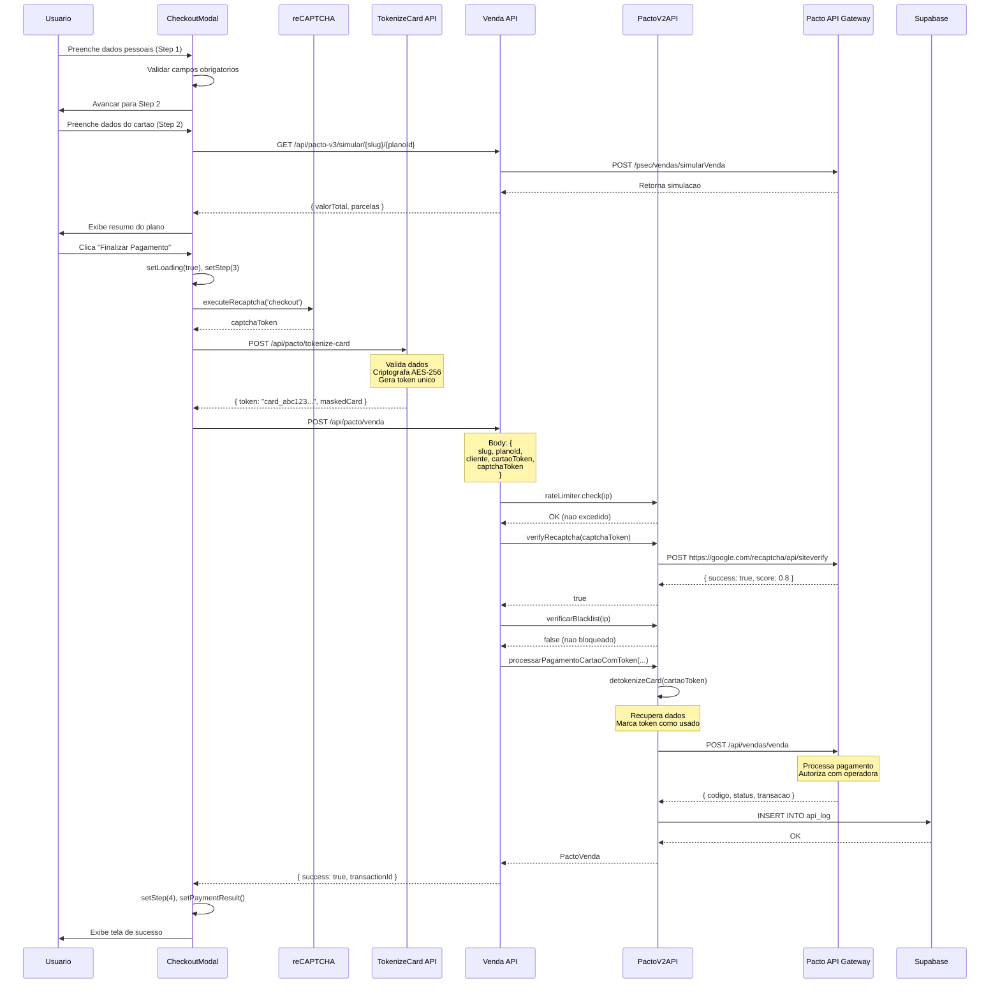
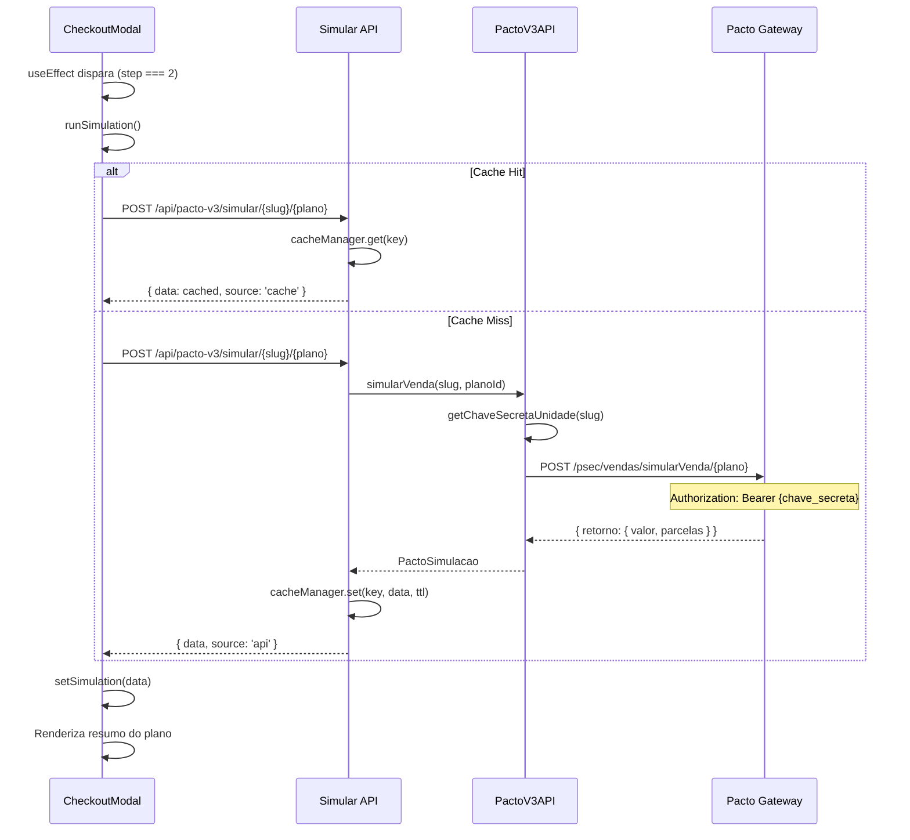

# Documentacao Tecnica: Integracao Pacto V3 e Sistema de Checkout

**Projeto**: Live Academia
**Sistema**: Next.js 15 (App Router)
**Data**: 2025-10-16
**Versao**: 1.0.0

---

## Indice

1. [Visao Geral](#1-visao-geral)
2. [Arquitetura do Sistema](#2-arquitetura-do-sistema)
3. [Dependencias e Servicos de Terceiros](#3-dependencias-e-servicos-de-terceiros)
4. [Fluxo Completo de Checkout](#4-fluxo-completo-de-checkout)
5. [Integracao com Pacto API V2](#5-integracao-com-pacto-api-v2)
6. [Integracao com Pacto API V3](#6-integracao-com-pacto-api-v3)
7. [Sistema de Seguranca](#7-sistema-de-seguranca)
8. [Gerenciamento de Estado](#8-gerenciamento-de-estado)
9. [Tratamento de Erros](#9-tratamento-de-erros)
10. [Diagrama de Sequencia](#10-diagrama-de-sequencia)
11. [Endpoints da API](#11-endpoints-da-api)
12. [Estrutura de Dados](#12-estrutura-de-dados)

---

## 1. Visao Geral

O sistema de checkout da Live Academia implementa um processo de matricula online completo, integrando pagamentos via cartao de credito, PIX e boleto atraves da API da Pacto Solucoes. O sistema suporta multiplas unidades (academias) com configuracoes individuais de chaves API.

### Caracteristicas Principais

- **Multi-step checkout**: Fluxo em 4 etapas (Dados → Pagamento → Processamento → Sucesso)
- **Dual API Integration**: Suporte tanto para API V2 quanto V3 da Pacto
- **PCI DSS Compliant**: Tokenizacao de dados de cartao de credito
- **Rate Limiting**: Protecao contra abuso de endpoints
- **Cache Estrategico**: Reducao de chamadas a API externa
- **Anti-fraude**: Integracao com reCAPTCHA v3
- **Fallback Estatico**: Sistema resiliente com dados estaticos

---

## 2. Arquitetura do Sistema

### 2.1 Camadas da Aplicacao

```
┌─────────────────────────────────────────────────────────┐
│                   CAMADA DE APRESENTACAO                 │
│  ┌────────────────────────────────────────────────────┐ │
│  │  CheckoutModal (React Component)                   │ │
│  │  - Gerenciamento de estado local                   │ │
│  │  - Validacao de formularios                        │ │
│  │  - Integracao com reCAPTCHA                        │ │
│  └────────────────────────────────────────────────────┘ │
└─────────────────────────────────────────────────────────┘
                          ↓
┌─────────────────────────────────────────────────────────┐
│                    CAMADA DE API (Next.js)               │
│  ┌────────────────────────────────────────────────────┐ │
│  │  Route Handlers                                    │ │
│  │  - /api/pacto/planos/[slug]                        │ │
│  │  - /api/pacto/venda                                │ │
│  │  - /api/pacto/tokenize-card                        │ │
│  │  - /api/pacto-v3/venda/[slug]                      │ │
│  │  - /api/pacto-v3/simular/[slug]/[planoId]          │ │
│  └────────────────────────────────────────────────────┘ │
└─────────────────────────────────────────────────────────┘
                          ↓
┌─────────────────────────────────────────────────────────┐
│                   CAMADA DE SERVICOS                     │
│  ┌────────────────────────────────────────────────────┐ │
│  │  PactoV2API  │  PactoV3API  │  Card Tokenization  │ │
│  │  Rate Limiter│  Cache Mgr   │  reCAPTCHA          │ │
│  └────────────────────────────────────────────────────┘ │
└─────────────────────────────────────────────────────────┘
                          ↓
┌─────────────────────────────────────────────────────────┐
│                  CAMADA DE INTEGRACAO                    │
│  ┌────────────────────────────────────────────────────┐ │
│  │  Pacto API (Gateway de Pagamento)                  │ │
│  │  - V2: https://api.pactosolucoes.com.br            │ │
│  │  - V3: https://apigw.pactosolucoes.com.br/psec     │ │
│  └────────────────────────────────────────────────────┘ │
└─────────────────────────────────────────────────────────┘
                          ↓
┌─────────────────────────────────────────────────────────┐
│                   CAMADA DE DADOS                        │
│  ┌────────────────────────────────────────────────────┐ │
│  │  Supabase (PostgreSQL)                             │ │
│  │  - Tabela: units (chaves API criptografadas)       │ │
│  │  - Tabela: api_log (auditoria)                     │ │
│  └────────────────────────────────────────────────────┘ │
└─────────────────────────────────────────────────────────┘
```

### 2.2 Fluxo de Dados

```
Usuario → CheckoutModal → API Route → Pacto Service → Pacto API
                                ↓
                         Token Storage
                         Cache Manager
                         Rate Limiter
                                ↓
                         Supabase (logs)
```

---

## 3. Dependencias e Servicos de Terceiros

### 3.1 Servicos Externos

| Servico | Proposito | Endpoint | Versao |
|---------|-----------|----------|--------|
| **Pacto API V2** | Pagamentos legacy | `https://api.pactosolucoes.com.br` | 2.x |
| **Pacto API V3** | Pagamentos moderna | `https://apigw.pactosolucoes.com.br/psec` | 3.x |
| **Google reCAPTCHA** | Anti-fraude | `https://www.google.com/recaptcha/api.js` | v3 |
| **Supabase** | Banco de dados | `https://[project].supabase.co` | PostgreSQL 15 |

### 3.2 Bibliotecas NPM

```json
{
  "axios": "^1.6.0",           // Cliente HTTP para Pacto API
  "framer-motion": "^10.x",    // Animacoes do modal
  "zod": "^3.22.0",            // Validacao de schemas
  "crypto": "node:crypto"      // Criptografia AES-256-GCM
}
```

### 3.3 Variaveis de Ambiente

```bash
# Pacto API - Chaves por unidade (V2)
PACTO_SECRET_KEY_TORRES=abc123...
PACTO_SECRET_KEY_CENTRO=def456...
PACTO_SECRET_KEY_CACHOEIRINHA=ghi789...

# Pacto API V3 - Chaves secretas por unidade
PACTO_SECRET_KEY_DEV_TORRES=xyz789...

# Seguranca
ENCRYPTION_SECRET=32_caracteres_minimo  # AES-256
NEXT_PUBLIC_RECAPTCHA_SITE_KEY=6Lf...
RECAPTCHA_SECRET_KEY=6Lf...

# Supabase
NEXT_PUBLIC_SUPABASE_URL=https://project.supabase.co
SUPABASE_SERVICE_ROLE_KEY=eyJhbGc...

# URLs
PACTO_API_URL=https://apigw.pactosolucoes.com.br
NEXT_PUBLIC_SITE_URL=https://liveacademia.com.br
```

### 3.4 Configuracao do Sistema

```typescript
// Timeouts
HTTP_TIMEOUT = 30000ms        // Pacto API
TOKEN_EXPIRY = 600000ms       // Tokens de cartao (10 min)
CACHE_TTL = 1800000ms         // Cache de planos (30 min)

// Rate Limits
PLANOS_RATE = 50/15min        // Consulta de planos
VENDA_RATE = 10/15min         // Processamento de vendas

// Seguranca
CARD_TOKEN_CACHE = In-Memory  // Producao: Redis
ENCRYPTION_ALGO = AES-256-GCM
```

---

## 4. Fluxo Completo de Checkout

### 4.1 Etapas do Checkout

#### Etapa 1: Dados Pessoais

**Responsabilidade**: Coleta e validacao de dados do cliente

**Campos Obrigatorios**:
- Nome completo
- Email
- Telefone (formatado)
- CPF (formatado e validado)
- Endereco completo (rua, numero, bairro, cidade, estado, CEP)
- Data de nascimento
- Sexo
- RG (opcional)
- Aceite dos termos de uso

**Validacoes**:
```typescript
// Validacao executada em handleNextStep()
const camposObrigatorios = [
  formData.nome,
  formData.email,
  formData.telefone,
  formData.cpf,
  formData.endereco,
  formData.numero,
  formData.bairro,
  formData.cidade,
  formData.estado,
  formData.cep,
  formData.dataNascimento,
  formData.sexo
]

if (!formData.aceiteTermos) {
  throw new Error('Termos nao aceitos')
}
```

#### Etapa 2: Pagamento

**Responsabilidade**: Coleta de dados de pagamento e simulacao

**Fluxo de Simulacao**:
1. Usuario avanca para Step 2
2. `useEffect` dispara `runSimulation()`
3. API Route `/api/pacto-v3/simular/[slug]/[planoId]` e chamada
4. Resposta exibe resumo do plano e valores

**Dados do Cartao** (apenas metodo suportado atualmente):
- Numero do cartao (formatado 1234 5678 9012 3456)
- Nome no cartao (uppercase)
- Validade (MM/AA)
- CVV (3-4 digitos)

**Preview Visual**:
- Componente `AnimatedPaymentCard` exibe preview 3D do cartao
- Atualiza em tempo real conforme usuario digita

#### Etapa 3: Processamento

**Responsabilidade**: Envio da transacao para Pacto API

**Sub-etapas**:

1. **Geracao de Token reCAPTCHA**
```typescript
const captchaToken = await executeRecaptcha('checkout')
```

2. **Tokenizacao do Cartao**
```typescript
const tokenizeResponse = await fetch('/api/pacto/tokenize-card', {
  method: 'POST',
  body: JSON.stringify({
    numero: formData.numeroCartao,
    nome: formData.nomeCartao,
    validade: formData.validadeCartao,
    cvv: formData.cvvCartao
  })
})
```

3. **Envio da Venda**
```typescript
const res = await fetch(`/api/pacto-v3/venda/${unidadeId}`, {
  method: 'POST',
  body: JSON.stringify({
    slug: unidadeId,
    planoId: plano.codigo,
    paymentMethod: 'cartao',
    cliente: { /* dados */ },
    cartaoToken: tokenizeResult.token,
    captchaToken
  })
})
```

#### Etapa 4: Sucesso/Erro

**Responsabilidade**: Feedback ao usuario

**Sucesso**:
- Exibe ID da transacao
- Detalhes da matricula
- Mensagem de confirmacao
- Email sera enviado (backend)

**Erro**:
- Retorna para Step 2
- Exibe mensagem de erro especifica
- Logs no console para debugging

### 4.2 Maquina de Estados

```
┌─────────────┐
│   Step 1    │ → Dados pessoais preenchidos?
│   (Dados)   │    └─ Sim → Step 2
└─────────────┘    └─ Nao → Alert
       ↓
┌─────────────┐
│   Step 2    │ → Executa simulacao
│ (Pagamento) │ → Dados do cartao preenchidos?
└─────────────┘    └─ Sim → processPayment()
       ↓            └─ Nao → Alert
┌─────────────┐
│   Step 3    │ → Loader exibido
│(Processando)│ → API retorna sucesso?
└─────────────┘    └─ Sim → Step 4
       ↓            └─ Nao → Step 2 (com erro)
┌─────────────┐
│   Step 4    │ → Exibe detalhes
│  (Sucesso)  │ → Botao "Fechar"
└─────────────┘
```

---

## 5. Integracao com Pacto API V2

### 5.1 Classe PactoV2API

**Arquivo**: [src/lib/api/pacto-v2.ts](../src/lib/api/pacto-v2.ts)

**Metodos Principais**:

```typescript
class PactoV2API {
  // Autenticacao
  async getToken(slug: string, ipPublico: string): Promise<string>

  // Consultas
  async getPlanosUnidade(slug: string): Promise<PactoPlano[]>
  async getUnidades(slug: string): Promise<PactoUnidade[]>

  // Pagamentos
  async processarPagamentoCartaoComToken(
    slug: string,
    captchaToken: string,
    vendaData: TokenizedVendaData
  ): Promise<PactoVenda>

  async processarPagamentoPIX(
    slug: string,
    captchaToken: string,
    vendaData: PactoVendaData
  ): Promise<PactoVenda>

  // Seguranca
  async verifyRecaptcha(token: string): Promise<boolean>
  async verificarBlacklist(ip: string): Promise<boolean>

  // Tokenizacao
  tokenizeCardData(cardData: EncryptedCardData): string
}
```

### 5.2 Formato de Requisicao

**Endpoint**: `POST /api/pacto/venda`

**Body**:
```json
{
  "slug": "torres",
  "planoId": "123",
  "paymentMethod": "cartao",
  "cliente": {
    "nome": "João Silva",
    "cpf": "12345678900",
    "email": "joao@email.com",
    "telefone": "11999999999",
    "endereco": "Rua das Flores",
    "numero": "123",
    "complemento": "Apto 45",
    "bairro": "Centro",
    "cidade": "Manaus",
    "estado": "AM",
    "cep": "69000000",
    "dataNascimento": "01/01/1990",
    "sexo": "M",
    "rg": "1234567"
  },
  "cartaoToken": "card_a1b2c3d4e5f6...",
  "captchaToken": "03AGdBq27..."
}
```

### 5.3 Formato de Resposta

**Sucesso**:
```json
{
  "success": true,
  "data": {
    "codigo": 54321,
    "status": "APROVADO",
    "valor": 19990,
    "transacao": "TXN-2025-001234",
    "cartaoAprovado": true
  }
}
```

**Erro**:
```json
{
  "success": false,
  "error": "Cartao recusado pela operadora"
}
```

---

## 6. Integracao com Pacto API V3

### 6.1 Classe PactoV3API

**Arquivo**: [src/lib/api/pacto-v3.ts](../src/lib/api/pacto-v3.ts)

**Base URL**: `https://apigw.pactosolucoes.com.br/psec`

**Autenticacao**: Bearer Token (chave secreta por unidade)

### 6.2 Endpoints Disponiveis

| Metodo | Endpoint | Descricao |
|--------|----------|-----------|
| GET | `/vendas/unidade` | Dados de uma unidade especifica |
| GET | `/vendas/unidades` | Listar todas as unidades |
| GET | `/vendas/planos` | Listar planos da unidade |
| GET | `/vendas/configs` | Configuracoes da empresa |
| POST | `/vendas/validarCupomDesconto` | Validar cupom |
| POST | `/vendas/simularVenda/{plano}` | Simular venda |
| POST | `/vendas/token` | Gerar token de venda |
| POST | `/vendas/cadastrarVenda` | Cadastrar venda |
| GET | `/vendas/produtos/{categoria}` | Produtos por categoria |
| GET | `/vendas/consultarCliente` | Consultar cliente |

### 6.3 Sistema de Chaves

**Chave Secreta**: Armazenada em variaveis de ambiente

```bash
# Formato da variavel de ambiente
PACTO_SECRET_KEY_[SLUG_UPPERCASE]=abc123def456...

# Exemplos
PACTO_SECRET_KEY_TORRES=f1e2d3c4b5a6...
PACTO_SECRET_KEY_CENTRO=a9b8c7d6e5f4...
```

**Logica de Carregamento**:
```typescript
private async getChaveSecretaUnidade(slug: string): Promise<string | null> {
  // 1. Tentar Vercel
  const chaveVercel = process.env[`PACTO_SECRET_KEY_${slug.toUpperCase()}`]
  if (chaveVercel) return chaveVercel

  // 2. Tentar Dev
  const chaveDev = process.env[`PACTO_SECRET_KEY_DEV_${slug.toUpperCase()}`]
  if (chaveDev) return chaveDev

  // 3. Falha
  return null
}
```

### 6.4 Exemplo de Uso

**Simulacao de Venda**:
```typescript
const simulacao = await pactoV3API.simularVenda('torres', 123)
console.log(simulacao.retorno.valor) // 19990 (R$ 199,90)
```

**Cadastro de Venda**:
```typescript
const dadosVenda = {
  unidade: 1,
  plano: 123,
  cliente: { /* ... */ },
  // ... outros campos
}

const token = await pactoV3API.gerarToken('torres', clientIP)
const venda = await pactoV3API.cadastrarVenda('torres', dadosVenda, token.retorno.token)
```

---

## 7. Sistema de Seguranca

### 7.1 Tokenizacao de Cartao (PCI DSS)

**Arquivo**: [src/lib/utils/card-tokenization.ts](../src/lib/utils/card-tokenization.ts)

**Fluxo**:

```
1. Frontend coleta dados do cartao
   ↓
2. POST /api/pacto/tokenize-card
   ↓
3. Validacao dos dados
   - Numero do cartao (13-19 digitos)
   - CVV (3-4 digitos)
   - Validade (MM/AA, nao expirado)
   - Nome (minimo 2 caracteres)
   ↓
4. Criptografia AES-256-GCM
   ↓
5. Geracao de token unico
   token = "card_" + randomBytes(16).hex
   ↓
6. Armazenamento em cache (10 minutos)
   Map<token, { data: encrypted, expiresAt, used }>
   ↓
7. Retorno do token ao frontend
   { token, maskedCard: "1234****5678", brand: "visa" }
   ↓
8. Frontend envia token na venda
   ↓
9. Backend recupera dados via detokenizeCard()
   ↓
10. Token e invalidado (usado = true)
```

**Seguranca**:
- Dados nunca trafegam em plain text
- Token e descartavel (uso unico)
- Expiracao automatica (10 minutos)
- Limpeza periodica de tokens expirados

### 7.2 Google reCAPTCHA v3

**Arquivo**: [src/hooks/use-recaptcha.ts](../src/hooks/use-recaptcha.ts)

**Integracao**:

1. **Frontend**: Hook carrega script do Google
```typescript
const { executeRecaptcha } = useRecaptcha()
const token = await executeRecaptcha('checkout')
```

2. **Backend**: Validacao do token
```typescript
async verifyRecaptcha(token: string): Promise<boolean> {
  const response = await fetch('https://www.google.com/recaptcha/api/siteverify', {
    method: 'POST',
    body: JSON.stringify({
      secret: process.env.RECAPTCHA_SECRET_KEY,
      response: token
    })
  })

  const data = await response.json()
  return data.success && data.score >= 0.5
}
```

**Score Minimo**: 0.5 (bloqueio de bots)

### 7.3 Rate Limiting

**Arquivo**: [src/lib/utils/rate-limiter.ts](../src/lib/utils/rate-limiter.ts)

**Implementacao**:
```typescript
class RateLimiter {
  private requests: Map<string, { count: number; resetAt: number }>

  check(ip: string, limit: number, window: number): boolean {
    const now = Date.now()
    const record = this.requests.get(ip)

    if (!record || now > record.resetAt) {
      this.requests.set(ip, { count: 1, resetAt: now + window })
      return true
    }

    if (record.count >= limit) {
      return false // Rate limit exceeded
    }

    record.count++
    return true
  }
}
```

**Limites Configurados**:
- `/api/pacto/planos/*`: 50 requisicoes / 15 minutos
- `/api/pacto/venda`: 10 requisicoes / 15 minutos
- IP tracking via `X-Forwarded-For` header

### 7.4 Criptografia de Chaves

**Arquivo**: [lib/crypto.ts](../lib/crypto.ts)

**Algoritmo**: AES-256-GCM

**Formato de Armazenamento**:
```json
{
  "v": 1,
  "iv": "base64_initialization_vector",
  "tag": "base64_authentication_tag",
  "data": "base64_encrypted_data"
}
```

**Uso**:
```typescript
// Criptografar
const encrypted = encrypt('minha_chave_api_secreta')

// Descriptografar
const plain = decrypt(encrypted)
```

---

## 8. Gerenciamento de Estado

### 8.1 Estado do Modal

**Arquivo**: [src/components/checkout/checkout-modal.tsx](../src/components/checkout/checkout-modal.tsx)

**Estados Principais**:

```typescript
const [step, setStep] = useState(1)                    // 1-4: etapa atual
const [paymentMethod, setPaymentMethod] = useState('cartao')
const [loading, setLoading] = useState(false)          // processamento
const [paymentResult, setPaymentResult] = useState<PactoResponse | null>(null)
const [simulation, setSimulation] = useState<SimulacaoResumo | null>(null)
const [simulationLoading, setSimulationLoading] = useState(false)
const [simulationError, setSimulationError] = useState<string | null>(null)

const [formData, setFormData] = useState({
  // Dados pessoais
  nome: '',
  email: '',
  telefone: '',
  cpf: '',
  // Endereco
  endereco: '',
  numero: '',
  complemento: '',
  bairro: '',
  cidade: '',
  estado: '',
  cep: '',
  // Outros
  dataNascimento: '',
  sexo: 'M',
  rg: '',
  aceiteTermos: false,
  // Cartao
  numeroCartao: '',
  nomeCartao: '',
  validadeCartao: '',
  cvvCartao: ''
})
```

### 8.2 Cache de Dados

**Arquivo**: [src/lib/utils/cache-manager.ts](../src/lib/utils/cache-manager.ts)

**Implementacao**:
```typescript
class CacheManager {
  private cache: Map<string, { data: any; expiresAt: number }>

  set(key: string, data: any, ttl: number): void {
    this.cache.set(key, { data, expiresAt: Date.now() + ttl })
  }

  get(key: string): any | null {
    const cached = this.cache.get(key)
    if (!cached || Date.now() > cached.expiresAt) {
      this.cache.delete(key)
      return null
    }
    return cached.data
  }
}
```

**Keys Utilizadas**:
- `planos:{slug}` - Cache de planos por unidade (30 min)
- `token:{slug}` - Cache de token Pacto (reutilizacao)

---

## 9. Tratamento de Erros

### 9.1 Tipos de Erro

| Tipo | Origem | Tratamento |
|------|--------|------------|
| **Validacao** | Frontend/Backend | Alert ao usuario |
| **API Timeout** | Pacto API | Retry automatico (1x) |
| **Rate Limit** | Rate Limiter | HTTP 429 + info de reset |
| **Token Invalido** | Tokenizacao | Solicitar re-tokenizacao |
| **Cartao Recusado** | Pacto API | Mensagem especifica ao usuario |
| **Erro Inesperado** | Sistema | Log + mensagem generica |

### 9.2 Estrategia de Fallback

**Planos**:
```typescript
try {
  const planos = await pactoV2API.getPlanosUnidade(slug)
  return { planos, source: 'api' }
} catch (error) {
  // Fallback para dados estaticos
  const staticPlanos = locations.find(l => l.id === slug)?.planos
  return { planos: staticPlanos, source: 'static', fallback: true }
}
```

### 9.3 Logs e Auditoria

**Tabela**: `api_log` (Supabase)

**Campos**:
- `id` (uuid)
- `unidade_id` (uuid FK)
- `direction` ('OUTBOUND' | 'INBOUND')
- `method` (GET, POST, etc)
- `endpoint` (string)
- `status_code` (integer)
- `latency_ms` (integer)
- `error` (text, nullable)
- `request_hash` (SHA-256, sem dados sensiveis)
- `created_at` (timestamp)

**Uso**:
```typescript
await logApi({
  unidade_id: unit.id,
  direction: 'OUTBOUND',
  method: 'POST',
  endpoint: '/psec/vendas/cadastrarVenda',
  status_code: 200,
  latency_ms: 1234,
  request_hash: sha256(sanitizedPayload)
})
```

---

## 10. Diagrama de Sequencia

### 10.1 Fluxo Completo de Venda com Cartao



### 10.2 Fluxo de Simulacao de Plano



---

## 11. Endpoints da API

### 11.1 Consulta de Planos

**Endpoint**: `GET /api/pacto/planos/[slug]`

**Parametros**:
- `slug`: Identificador da unidade (path param)

**Resposta**:
```json
{
  "planos": [
    {
      "codigo": 123,
      "nome": "Plano Diamante",
      "mensalidade": 19990,
      "adesao": 0,
      "fidelidade": 12,
      "modalidades": ["Musculacao", "Aerobica"],
      "regimeRecorrencia": true
    }
  ],
  "fallback": false,
  "source": "api"
}
```

**Rate Limit**: 50 req / 15 min

### 11.2 Tokenizacao de Cartao

**Endpoint**: `POST /api/pacto/tokenize-card`

**Body**:
```json
{
  "numero": "4111111111111111",
  "nome": "JOAO SILVA",
  "validade": "12/25",
  "cvv": "123",
  "parcelas": 1
}
```

**Resposta**:
```json
{
  "success": true,
  "token": "card_a1b2c3d4e5f6789012345678",
  "expiresAt": 1697654321000,
  "maskedCard": "4111****1111",
  "brand": "visa"
}
```

**Erros Comuns**:
- 400: "Numero do cartao invalido"
- 400: "CVV invalido"
- 400: "Cartao expirado"

### 11.3 Processamento de Venda (V2)

**Endpoint**: `POST /api/pacto/venda`

**Headers**:
- `Content-Type: application/json`
- `X-Forwarded-For: {client_ip}` (automatico)

**Body**: Ver secao 5.2

**Resposta**: Ver secao 5.3

**Rate Limit**: 10 req / 15 min

### 11.4 Processamento de Venda (V3)

**Endpoint**: `POST /api/pacto-v3/venda/[slug]`

**Body**: Similar a V2, mas com estrutura adaptada para V3

**Resposta**:
```json
{
  "success": true,
  "retorno": {
    "codigo": 54321,
    "status": "APROVADO",
    "valor": 19990,
    "transacao": "TXN-2025-001234"
  }
}
```

### 11.5 Simulacao de Venda (V3)

**Endpoint**: `POST /api/pacto-v3/simular/[slug]/[planoId]`

**Body**:
```json
{
  "slug": "torres",
  "planoId": "123",
  "cliente": {
    "nome": "Cliente Teste",
    "cpf": "00000000000",
    "email": "teste@email.com"
  }
}
```

**Resposta**:
```json
{
  "success": true,
  "data": {
    "valorTotal": 19990,
    "parcelas": [
      { "numero": 1, "valor": 19990, "vencimento": "2025-11-16" }
    ]
  }
}
```

---

## 12. Estrutura de Dados

### 12.1 Interface PactoPlano (V2)

```typescript
interface PactoPlano {
  codigo: number                          // ID unico do plano
  nome: string                            // Ex: "Plano Diamante"
  mensalidade: number                     // Valor em centavos (19990 = R$ 199,90)
  primeiraParcela: number
  adesao: number                          // Taxa de adesao
  fidelidade: number                      // Meses de fidelidade
  parcelamentoOperadora: boolean
  maxDivisao: number                      // Maximo de parcelas
  modalidades: string[]                   // ["Musculacao", "Aerobica"]
  diasVencimento: number[]                // [5, 10, 15, 20, 25]
  regimeRecorrencia: boolean              // Cobranca recorrente
  renovavelAutomaticamente: boolean
  matricula: number
  valorTotalDoPlano: number
  modalidadesDTO: Array<{
    codigo: number
    modalidade: string
    nrVezesSemana: number
    selected: boolean
  }>
}
```

### 12.2 Interface PactoV3Plano

```typescript
interface PactoV3Plano {
  // Campos identicos a V2, mas com adicoes:
  descricaoEncantamento: string | null    // Marketing
  videoSiteUrl: string | null
  observacaoSite: string | null
  cobrarProdutoSeparado: boolean
  cobrarAdesaoSeparado: boolean
  permitirCompartilharPLanoNoSite: boolean
  produtoTaxaCancelamento: string
  percentualMultaCancelamento: number
}
```

### 12.3 Interface PactoCliente

```typescript
interface PactoCliente {
  nome: string                            // Obrigatorio
  cpf: string                             // Apenas numeros
  email: string                           // Obrigatorio
  telefone: string                        // (11) 99999-9999
  endereco: string
  numero: string
  complemento: string
  bairro: string
  cidade: string
  estado: string                          // Sigla (SP, AM, etc)
  cep: string                             // 12345-678
  dataNascimento: string                  // DD/MM/AAAA
  sexo: 'M' | 'F' | 'O'
  rg: string
}
```

### 12.4 Interface EncryptedCardData

```typescript
interface EncryptedCardData {
  numero: string                          // 13-19 digitos
  nome: string                            // Nome no cartao
  validade: string                        // MM/AA
  cvv: string                             // 3-4 digitos
  parcelas?: number                       // Default: 1
}
```

### 12.5 Tabela Units (Supabase)

```sql
CREATE TABLE units (
  id UUID PRIMARY KEY DEFAULT gen_random_uuid(),
  slug TEXT UNIQUE NOT NULL,              -- 'torres', 'centro', etc
  nome TEXT NOT NULL,                     -- 'Live Academia Torres'
  codigo_unidade TEXT NOT NULL,           -- Codigo usado na API Pacto

  -- Localizacao
  cidade TEXT,
  estado TEXT,
  cep TEXT,
  endereco TEXT,
  complemento TEXT,
  latitude DOUBLE PRECISION,
  longitude DOUBLE PRECISION,

  -- Visual
  logo TEXT,                              -- URL da logo
  imagens TEXT[],                         -- Array de URLs

  -- Chaves API (criptografadas)
  chave_publica TEXT,                     -- Chave publica (plain)
  chave_api TEXT NOT NULL,                -- Chave privada (encrypted JSON)

  -- Contato
  telefone TEXT,
  email TEXT,

  -- Configuracoes
  locale TEXT DEFAULT 'pt-BR',
  moeda TEXT DEFAULT 'BRL',
  usarSistemaInternacional BOOLEAN DEFAULT false,

  -- Auditoria
  created_at TIMESTAMP DEFAULT NOW(),
  updated_at TIMESTAMP DEFAULT NOW()
);
```

---

## Consideracoes Finais

Este documento reflete o estado atual da integracao Pacto V3 e sistema de checkout da Live Academia.

**Proximos Passos**:

1. Migrar token cache para Redis (producao)
2. Implementar circuit breaker para Pacto API
3. Adicionar testes de integracao (Playwright)
4. Melhorar tratamento de erros com Sentry
5. Implementar suporte a PIX e Boleto no frontend
6. Adicionar dashboard de metricas de conversao

**Contato Tecnico**:
- Time de desenvolvimento: dev@liveacademia.com.br
- Documentacao completa: `/docs`

---

**Ultima Atualizacao**: 2025-10-16
**Revisao**: 1.0.0
**Autores**: Equipe Live Academia
