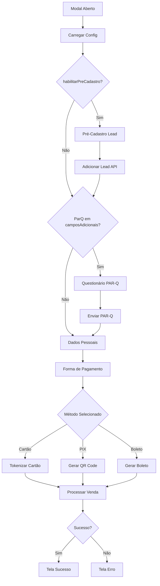

# Integração do Checkout V2 - Live Academia

## Visão Geral

O novo sistema de checkout implementa um fluxo condicional baseado nas configurações dinâmicas retornadas pela API `/psec/vendas/configs`. O fluxo adapta-se automaticamente para incluir ou pular etapas conforme necessário.

## Fluxo Completo do Checkout V2



## Novos Endpoints da API

### 1. Configuração de Vendas
```
GET /api/pacto-v3/vendas/configs/[slug]
```
Retorna configurações que controlam:
- Quais campos são obrigatórios
- Métodos de pagamento disponíveis
- Se pré-cadastro é necessário
- Se PAR-Q é necessário

### 2. Adicionar Lead
```
POST /api/pacto-v3/lead/[slug]
Body: {
  nome: string,
  email: string,
  telefone: string
}
```

### 3. Questionário PAR-Q
```
GET /api/pacto-v3/parq/[slug] - Buscar perguntas
POST /api/pacto-v3/parq/[slug] - Enviar respostas
```

### 4. Consulta CEP
```
GET /api/cep/consultar?cep=00000000
```

## Como Usar o Novo Checkout

### 1. Importar o Componente

```tsx
import CheckoutModalV2 from '@/components/checkout/checkout-modal-v2'
```

### 2. Implementar no Componente

```tsx
'use client'

import { useState } from 'react'
import CheckoutModalV2 from '@/components/checkout/checkout-modal-v2'

export function UnidadeDetalhes({ unidade, planos }) {
  const [isModalOpen, setIsModalOpen] = useState(false)
  const [selectedPlano, setSelectedPlano] = useState(null)

  const handleMatricular = (plano) => {
    setSelectedPlano(plano)
    setIsModalOpen(true)
  }

  return (
    <>
      {/* Seus componentes */}
      <button onClick={() => handleMatricular(plano)}>
        Matricular
      </button>

      {/* Novo Modal de Checkout */}
      <CheckoutModalV2
        isOpen={isModalOpen}
        onClose={() => {
          setIsModalOpen(false)
          setSelectedPlano(null)
        }}
        plano={selectedPlano}
        unidadeName={unidade.nome}
        unidadeId={unidade.slug}
      />
    </>
  )
}
```

## Funcionalidades Implementadas

### ✅ Pré-Cadastro de Leads
- Coleta nome, email e telefone antes do checkout
- Ativado quando `habilitarPreCadastro: true`
- Envia lead para sistema Pacto

### ✅ Questionário PAR-Q
- Questionário de prontidão para atividade física
- Ativado quando `"ParQ"` está em `camposAdicionais`
- 10 perguntas sobre saúde
- Alerta se houver respostas positivas

### ✅ Consulta Automática de CEP
- Preenche endereço automaticamente
- Usa APIs ViaCEP e Brasil API como fallback
- Debounce de 500ms

### ✅ Campos Dinâmicos
- Exibe apenas campos configurados em `camposAdicionais`
- Campos opcionais vs obrigatórios
- Validação condicional

### ✅ Métodos de Pagamento Configuráveis
- Cartão: `apresentarCartaoVenda: true`
- PIX: `apresentarPix: true`
- Boleto: `apresentarBoleto: true`

## Estados e Steps

O checkout possui os seguintes estados:

1. **loading-config**: Carregando configurações
2. **pre-cadastro**: Formulário de lead (se habilitado)
3. **parq**: Questionário PAR-Q (se habilitado)
4. **dados-pessoais**: Formulário completo de dados
5. **pagamento**: Seleção de método e dados de pagamento
6. **processando**: Processando pagamento
7. **sucesso**: Pagamento aprovado
8. **erro**: Erro no pagamento

## Campos Configuráveis

Os seguintes campos podem ser tornados obrigatórios via `camposAdicionais`:

- `TELEFONE`: Telefone/WhatsApp
- `CEP`: CEP com busca automática
- `ENDERECO`: Endereço completo
- `NUMERO`: Número do endereço
- `BAIRRO`: Bairro
- `COMPLEMENTO`: Complemento
- `SEXO`: Sexo (M/F/O)
- `DT_NASCIMENTO`: Data de nascimento
- `RG`: RG (opcional)
- `CUPOM_DESCONTO`: Campo para cupom

## Exemplo de Configuração

```json
{
  "habilitarPreCadastro": true,
  "apresentarCartaoVenda": true,
  "apresentarPix": true,
  "apresentarBoleto": false,
  "camposAdicionais": [
    "TELEFONE",
    "CEP",
    "ENDERECO",
    "NUMERO",
    "BAIRRO",
    "COMPLEMENTO",
    "SEXO",
    "DT_NASCIMENTO",
    "ParQ"
  ],
  "titulocheckout": "Bora treinar?"
}
```

## Fluxo de Dados

### 1. Configuração Inicial
```typescript
// Ao abrir modal
fetch(`/api/pacto-v3/vendas/configs/${unidadeId}`)
  .then(config => {
    // Determina fluxo baseado em config
    if (config.habilitarPreCadastro) {
      step = 'pre-cadastro'
    } else if (config.camposAdicionais.includes('ParQ')) {
      step = 'parq'
    } else {
      step = 'dados-pessoais'
    }
  })
```

### 2. Pré-Cadastro (se habilitado)
```typescript
// Enviar lead
fetch(`/api/pacto-v3/lead/${unidadeId}`, {
  method: 'POST',
  body: { nome, email, telefone }
})
  .then(response => {
    leadId = response.leadId
    // Próximo step
  })
```

### 3. PAR-Q (se habilitado)
```typescript
// Buscar questionário
fetch(`/api/pacto-v3/parq/${unidadeId}`)

// Enviar respostas
fetch(`/api/pacto-v3/parq/${unidadeId}`, {
  method: 'POST',
  body: { leadId, respostas, aceitouTermos }
})
```

### 4. Processamento de Pagamento
```typescript
// Tokenizar cartão (se método = cartão)
fetch('/api/pacto/tokenize-card', {
  method: 'POST',
  body: { numero, nome, validade, cvv }
})

// Processar venda
fetch(`/api/pacto-v3/venda/${unidadeId}`, {
  method: 'POST',
  body: {
    planoId,
    paymentMethod,
    cliente,
    captchaToken,
    cartaoToken,
    leadId
  }
})
```

## Tratamento de Erros

- Configurações não carregadas: usa configuração padrão
- Lead API falha: permite continuar sem lead ID
- PAR-Q falha: permite pular questionário
- CEP não encontrado: permite preenchimento manual
- Pagamento falha: exibe erro e permite retry

## Analytics

O novo checkout mantém todos os eventos de tracking:

- `checkout_start`: Modal aberto
- `lead_captured`: Lead capturado (novo)
- `parq_completed`: PAR-Q completo (novo)
- `checkout_step_view`: Cada step visualizado
- `payment_attempt`: Tentativa de pagamento
- `purchase`: Conversão final

## Migração do Checkout V1 para V2

### Mudanças Necessárias

1. **Importar novo componente**
   ```tsx
   // Antes
   import CheckoutModal from '@/components/checkout/checkout-modal'

   // Depois
   import CheckoutModalV2 from '@/components/checkout/checkout-modal-v2'
   ```

2. **Props continuam iguais**
   - `isOpen`
   - `onClose`
   - `plano`
   - `unidadeName`
   - `unidadeId`

### Vantagens do V2

1. **Fluxo Adaptativo**: Ajusta-se baseado em configurações
2. **Menor Fricção**: Pré-cadastro captura lead antes
3. **Mais Segurança**: PAR-Q para saúde do aluno
4. **UX Melhorada**: CEP automático, validações em tempo real
5. **Configurável**: Admin pode controlar campos e fluxo

## Testes Recomendados

1. **Teste com Pré-Cadastro**
   - Configure `habilitarPreCadastro: true`
   - Verifique se lead é criado

2. **Teste com PAR-Q**
   - Adicione `"ParQ"` em `camposAdicionais`
   - Responda "Sim" para ver alerta

3. **Teste CEP**
   - Digite CEP válido
   - Verifique preenchimento automático

4. **Teste Métodos de Pagamento**
   - Teste com apenas cartão
   - Teste com PIX habilitado
   - Teste com todos métodos

## Troubleshooting

### Modal não abre
- Verifique se `isOpen={true}`
- Verifique console para erros de config

### Pré-cadastro não aparece
- Verifique se `habilitarPreCadastro: true` na config
- Verifique resposta de `/api/pacto-v3/vendas/configs/[slug]`

### PAR-Q não aparece
- Verifique se `"ParQ"` está em `camposAdicionais`
- Verifique se lead foi criado antes

### CEP não preenche
- Verifique se CEP é válido (8 dígitos)
- Verifique console para erro de API

### Pagamento falha
- Verifique reCAPTCHA carregado
- Verifique dados do cartão
- Verifique console para erros de API

## Conclusão

O Checkout V2 oferece uma experiência mais flexível e configurável, adaptando-se às necessidades de cada unidade. A implementação mantém compatibilidade com o código existente, facilitando a migração.