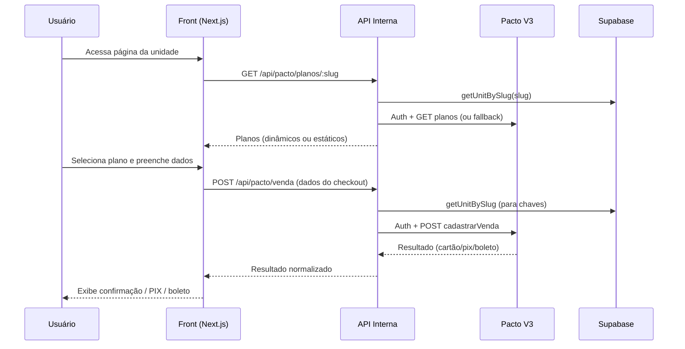

<!--
  Relatório de Implementação
  Gerado em 2025-09-22
-->

# Relatório de Implementação – Plataforma Live Academia

Data: 22/09/2025  
Versão do código (branch atual): `main`

## 1. Visão Geral

Este documento consolida o que já foi implementado no projeto para suportar:

- Integração com a API Pacto Soluções (V3 `/psec`) usando **par de chaves por unidade** (`chave_api` + `chave_publica`).
- Refatoração do modelo de dados para **tabela única `units`** (substituindo o modelo anterior `rede` + `unidade`).
- Criptografia de chaves sensíveis (AES-256-GCM) em repouso.
- Fetch dinâmico de planos por unidade com fallback estático e exibição no front.
- Fluxo de checkout (cartão, PIX, boleto) via endpoints internos server-side.
- Logging de chamadas externas e internas sem exposição de payload sensível.

## 2. Arquitetura Técnica (Resumo)

| Camada | Responsabilidade | Principais Arquivos |
|--------|------------------|----------------------|
| Persistência | Tabela `units`, logging em `api_log` | `supabase/schema.sql`, `lib/repository.ts` |
| Criptografia | Cifrar/decifrar `chave_api` (AES-256-GCM) | `lib/crypto.ts` |
| Integração Pacto | Autenticação, cache de token, planos, simulação, venda, cupom | `lib/pacto-api.ts`, `lib/pacto-schemas.ts` |
| API Interna | Endpoints server-only para front consumir | `app/api/pacto/*` |
| Front (Planos) | Buscar planos dinâmicos / fallback | `components/unit-planos.tsx` |
| Checkout | Modal, envio de venda | `components/checkout-modal.tsx` |
| UI Cards | Exibição de planos clicáveis | `components/planos-cards.tsx` |

## 3. Modelo de Dados Atual (`units`)

Campos relevantes (subset):
- `slug` (único, usado como identificador lógico no front e rotas)
- `codigo_unidade` (mapeado para API Pacto – enviado como `unidade`/filtro de planos)
- `chave_publica` (texto plano – necessária em todas as chamadas à API Pacto V3)
- `chave_api` (JSON criptografado contendo ciphertext da key privada)
- Metadados adicionais: localização, contato, imagens, moeda, etc.

Logs em `api_log` armazenam: `direction`, `method`, `endpoint`, `status_code`, `latency_ms`, `error` e `request_hash` (SHA-256 do corpo – sem corpo em claro).

## 4. Criptografia

- Algoritmo: **AES-256-GCM**.
- Derivação da chave: `SHA-256(ENCRYPTION_SECRET)`.
- Formato armazenado: `{"v":1,"iv","tag","data"}` (Base64).
- Funções: `encrypt()`, `decrypt()` em `lib/crypto.ts`.
- Rotação planejada (não implementada ainda): recriptografar valores após alterar secret.

## 5. Integração Pacto (Dual-Key)

Todas as chamadas usam par (`redeKey = chave_api decriptada`, `publicKey = chave_publica`).

Fluxo de autenticação:
1. POST `/psec/vendas/token` com `{ redeKey, publicKey }`.
2. Token armazenado em cache em `Map` chaveado por `redeKey|publicKey` com validade aproximada (`expiresIn` ou fallback de 15 min).
3. Renovação antecipada (30s antes de expirar).

Endpoints encapsulados em `PactoAPI`:
- `getPlanosUnidade(redeKey, publicKey, codigoUnidade)`
- `simularVenda(redeKey, publicKey, planoId, payload)`
- `vendaCartao|vendaPix|vendaBoleto(redeKey, publicKey, captcha, saleData)`
- `validarCupomDesconto(redeKey, publicKey, cupom, unidadeId)`

Auxiliar público:
- `processCheckout(redeKey, publicKey, paymentMethod, saleData)` – roteia para o método correto.

## 6. Endpoints Internos Implementados

| Rota | Método | Objetivo | Observações |
|------|--------|----------|-------------|
| `/api/pacto/planos/[slug]` | GET | Buscar planos da unidade | Fallback estático se sem chave ou unidade ausente |
| `/api/pacto/simular` | POST | (Disponível) simular valores | Usa `planoId`, `unidade`, cupom (se enviado) |
| `/api/pacto/venda` | POST | Criar venda (cartão/pix/boleto) | Usa `processCheckout` com par de chaves |
| `/api/checkout/pagamento` | POST | (Legacy / adaptado) fluxo de pagamento central | Atualizado para dual-key |

Validações e status especiais:
- 404: unidade não encontrada.
- 503: chaves ausentes (não expõe detalhes da falta individualmente no corpo).
- Fallback de planos: marcado em resposta com `{ fallback: true, source: 'static' }`.

## 7. Frontend – Fluxo de Planos e Checkout

1. Página de unidade monta `UnitPlanos` com `slug`.
2. `UnitPlanos` chama `/api/pacto/planos/:slug` e mapeia `{ nome, valor, codigo }` → `{ name, price, codigo }`.
3. Exibição via `PlanosCards` – clique em MATRICULAR-SE abre `CheckoutModal` com o plano selecionado.
4. `CheckoutModal`:
   - Passos: Dados → Pagamento → Processando → Sucesso.
   - Monta payload: `{ slug (unidade), planoId (plano.codigo), planoNome, valor, paymentMethod, customer, cardData? }`.
   - Envia para `/api/pacto/venda`.
   - Exibe resultado: transação, pixCode ou boletoUrl.

## 8. Segurança & Boas Práticas Aplicadas

- Módulo `pacto-api.ts` server-only (console.warn se importado no client).
- Nenhuma chave sensível enviada ao cliente.
- Chave privada cifrada em repouso.
- Hash de requests em log (evita armazenar payload bruto).
- Sanitização de CPF para dígitos somente antes de envio.
- Cartão: nunca logado; apenas transitório no POST.

## 9. Itens Pendentes / Melhorias Futuras

| Item | Status | Notas |
|------|--------|-------|
| Simulação automática antes de venda | Pendente | Chamar `/api/pacto/simular` no passo 2 do modal |
| Validação e aplicação de cupom | Pendente | Integrar `validarCupomDesconto` no front |
| Circuit breaker na camada de integração | Pendente | Contar falhas por par de chaves e pausar temporariamente |
| Testes automatizados (unit/integration) | Pendente | Mock de fetch + rotas Next |
| Script de rotação de secret | Pendente | Recriptografar lote |
| Observabilidade (Sentry / métricas) | Planejado | Capturar erros de rota e performance |
| Tratamento de expiração granular do token | Básico | Pode melhorar com jitter/backoff |
| Simulação de valor exibido dinamicamente no modal | Pendente | Atualizar valor final conforme API |

## 10. Decisões Tomadas

- Remoção definitiva do conceito de `rede` – simplificação do domínio.
- Cache em memória (Node runtime) suficiente na fase atual (sem redis) – escalar depois se multi-instância.
- `chave_publica` deixada em claro (não criptografada) por não ser sensível no contexto atual (reavaliar se política mudar).
- Fallback de planos mantido para UX resiliente em caso de erro temporário com Pacto.

## 11. Principais Pontos de Entrada de Código

| Componente/Módulo | Função Chave |
|-------------------|--------------|
| `lib/pacto-api.ts` | Wrapper + autenticação + vendas |
| `lib/repository.ts` | CRUD lógico de `units`, logging |
| `components/unit-planos.tsx` | Fetch dinâmico no client + fallback |
| `components/checkout-modal.tsx` | Orquestração do fluxo de pagamento |
| `app/api/pacto/*` | Interface segura para o front |

## 12. Fluxo Resumido (Checkout)

## 13. Riscos / Observações

- Escalabilidade de cache de token: em múltiplas instâncias, cada uma mantém seu cache independente.
- Fallback estático pode ficar desatualizado se divergirem planos: ideal ter marcação de versão e/ou expiração.
- Ausência de testes automatizados aumenta risco em refactors futuros (priorizar).
- Captura de erros hoje apenas em console/log — instrumentar Sentry.

## 14. Próximos Passos Recomendados (Prioridade)

1. Adicionar chamada a `/api/pacto/simular` antes da venda para validar valor/cupom.
2. Implementar validação de cupom (botão “Aplicar” no passo 2 do checkout).
3. Criar testes para: planos (success/fallback), venda cartão/pix/boleto (mock), cupom inválido.
4. Circuit breaker simples (3 falhas consecutivas => bloquear 60s por par de chave).
5. Métricas (tempo médio de autenticação, latência de venda, taxa de erro por método).

## 15. Conclusão

O núcleo funcional solicitado está ativo: **planos dinâmicos por unidade**, **checkout com par de chaves** e **persistência com criptografia**. Restam incrementos de robustez (simulação pré-venda, validação de cupom, testes e observabilidade) para endurecer o fluxo em produção.

---
_Relatório gerado automaticamente. Atualize este arquivo conforme novas funcionalidades forem entregues._
